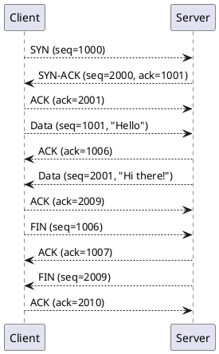

# **Day 3: Network Troubleshooting with Linux Tools**

---

## **1. Advanced Routing and Network Namespaces**

### **Introduction to Routing**

- **What is routing?**
  - Directing network packets(small chunks of data) from source to destination.
- **Routing Tables**
  - View with `route` or `ip route show`.
  - Example:
    ```bash
    ip route show
    ```
    Output:
    ```plaintext
    default via 192.168.1.1 dev eth0
    192.168.1.0/24 dev eth0 proto kernel scope link src 192.168.1.100
    ```

---

### **Policy-Based Routing**

- Use `ip rule` for advanced routing:
  - Example: Route traffic from a specific subnet via a different gateway:
    ```bash
    ip rule add from 192.168.1.0/24 table 100
    ip route add default via 192.168.1.254 dev eth1 table 100
    ```

### **Network Namespaces**

- **What are Network Namespaces?**
  - Isolated network stacks (routes, interfaces, etc.).
- **Commands**
  - Create a namespace:
    ```bash
    ip netns add test_ns
    ```
  - Assign an interface:
    ```bash
    ip link add veth0 type veth peer name veth1
    ip link set veth1 netns test_ns
    ```
  - View namespace-specific routes:
    ```bash
    ip netns exec test_ns ip route show
    ```

---

### **Quiz**

- What is the OSI model and how does this differ from the TCP/IP model.

### **Hands-On Activity**

- Simulate two isolated networks communicating via a shared gateway.
  - Tools: `ip netns`, `veth`.

---

## **2. Diagnosing Common TCP/IP Issues**

### **Representation of TCP Three-Way Handshake**



---

### **Understanding TCP/IP Basics**

- Layers of TCP/IP (OSI reference).
- Common issues:
  - Connection timeout.
  - Packet loss.
  - SYN floods.

---

### **Tools for Diagnosing Issues**

- **`ping`**: Check connectivity.
  ```bash
  ping -c 4 8.8.8.8
  ```
- **`traceroute`**: Trace packet route
  ```bash
  traceroute 8.8.8.8
  ```
- **`netstat/ss`**: Analyze connections
  ```bash
  ss -tuln
  ```
- **`tcpdump`**: Capture packets
  ```bash
  tcpdump -i eth0 port 80
  ```

---

### Common TCP/IP Issues

**SYN Floods**

- Identify with netstat:

```bash
netstat -an | grep :80 | grep SYN
```

- Mitigation:
  - Use iptables to limit connection rate:
  ```bash
  iptables -A INPUT -p tcp --syn --dport 80 -m limit --limit 10/s --limit-burst 20 -j ACCEPT
  ```
  **Dropped Packets**

```bash
ip -s link show eth0
```

---

## Deep Dive int Network Security

### **Firewall Basics**

**iptables**:
iptables is a user-space utility for managing packet filtering and NAT (Network Address Translation) rules in the Linux kernel

- Structure: Tables -> Chains -> Rules.
- Example: Block traffic from a specific IP:

```bash
iptables -A INPUT -s 203.0.113.5 -j DROP
```

- Save configuration:

```bash
iptables-save > /etc/iptables/rules.v4
```

**ufw (Uncomplicated Firewall)**:

- Enable/disable:

```bash
ufw enable
ufw disable
```

- Allow/deny traffic:

```bash
ufw allow 22/tcp
ufw deny 80
```

---

### Intrusion Detection with Fail2ban

- What is Fail2ban?
- Monitors logs for suspicious activity and bans offenders.
- Setup and Configuration
- Install:

```bash
sudo apt install fail2ban
```

- Configure jail:

```txt
[sshd]
enabled = true
port = ssh
logpath = /var/log/auth.log
maxretry = 5
```

- Start the service:

```bash
systemctl enable fail2ban
systemctl start fail2ban
```

## Hands-On Activity

- Configure iptables and fail2ban to secure a Linux server against brute force attacks.

## Hands-On Lab: Simulate and Troubleshoot Network Outages

### Objective

- Learn how to simulate network issues and troubleshoot them effectively.

**Scenario 1: Simulate a SYN Flood**

1. Simulate:

- Use hping3 to create SYN flood:

```bash
hping3 -S -p 80 --flood <target-ip>
```

2. Detect:

- Monitor with netstat or ss:

```bash
ss -s
```

**Scenario 2: Network Interface Outage**

1. Simulate:

- Bring down the virtual interface:

```bash
ip link set veth0 down
```

2. Troubleshoot:

- Check interface status:

```bash
ip link show veth0
```

---

## Key Takeaways

- Routing: Master routing tables and namespaces for advanced networking.
- Diagnostics: Use tools like tcpdump, netstat, and ss for TCP/IP troubleshooting.
- Security: Strengthen defenses with iptables, ufw, and fail2ban.
- Hands-On Skills: Simulate and resolve real-world network outages.

## Resources

- [Linux Networking Commands Cheat Sheet](https://www.cyberciti.biz/faq/linux-networking-commands/)
- [Iptables Tutorial](https://netfilter.org/documentation/)
- [Fail2ban Documentation](https://www.fail2ban.org/)
- [Understanding kubernetes Networking Model](https://sookocheff.com/post/kubernetes/understanding-kubernetes-networking-model/)
- [K8s Networking Architecture](https://cloudnativenow.com/topics/cloudnativenetworking/understanding-kubernetes-networking-architecture/)- [K8s Network Packets](https://learnk8s.io/kubernetes-network-packets)
- [k8s Networking Fundamentals](https://opensource.com/article/22/6/kubernetes-networking-fundamentals)
