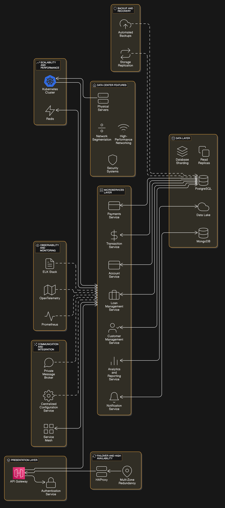

# System Design of A Bank

## Introduction
The banking application is designed using a microservices architecture deployed in a private data center to handle critical financial operations, ensuring high availability, scalability, and security. This document outlines the architecture, core components, and best practices followed during the design and implementation.

---

## System Overview
The banking application supports the following features:
- Customer onboarding and management
- Account creation and management
- Transaction processing (deposits, withdrawals, and transfers)
- Loan management (applications, disbursements, and repayments)
- Payment processing for external integrations
- Notification services (SMS, email, push notifications)
- Analytics and reporting dashboards

The system ensures:
- **Scalability:** Supports increasing loads with horizontal scaling.
- **High Availability:** Fault tolerance through failover mechanisms and redundancy.
- **Performance:** Optimized for low latency and high throughput.

---

## Architecture
The system architecture is based on a microservices approach with the following key layers:

1. **Presentation Layer**:
   - API Gateway: Acts as the single entry point for web and mobile clients.
   - Authentication Service: Handles login, session management, and multi-factor authentication (MFA).

2. **Microservices Layer**:
   - Core services include:
     - Customer Management
     - Account Service
     - Transaction Service
     - Payments Service
     - Loan Management
     - Notification Service
     - Analytics and Reporting

3. **Data Layer**:
   - Relational Databases (PostgreSQL) for transactional data.
   - NoSQL Databases (MongoDB) for semi-structured data.
   - Data Lake for analytical and historical data.
   - Database sharding and read replicas for scalability and high throughput.

4. **Infrastructure**:
   - Kubernetes for container orchestration.
   - Load balancers (e.g., HAProxy) for traffic distribution and failover.
   - Private message broker (e.g., Kafka) for asynchronous communication.
   - Service mesh (e.g., Istio) for inter-service communication.

5. **Observability and Monitoring**:
   - Centralized logging (ELK Stack).
   - Monitoring tools (Prometheus, Grafana).
   - Distributed tracing (OpenTelemetry).

---

## Core Components

### Presentation Layer
- **API Gateway:** Routes incoming requests to the appropriate microservices, handles rate limiting, and ensures secure communication.
- **Authentication Service:** Provides secure user authentication using MFA and session management.

### Microservices Layer
Each service is independently deployable and communicates via REST or asynchronous messaging.
- **Customer Management Service:** Handles KYC, user profiles, and onboarding.
- **Account Service:** Manages account creation and balance inquiries.
- **Transaction Service:** Processes deposits, withdrawals, and transfers.
- **Payments Service:** Integrates with external payment gateways for bill payments.
- **Loan Management Service:** Supports loan application workflows.
- **Notification Service:** Sends alerts via SMS, email, and push notifications.
- **Analytics and Reporting Service:** Provides business insights and compliance reports.

### Data Layer
- **PostgreSQL:** Primary database for transactional data.
- **MongoDB:** Stores semi-structured data like user preferences.
- **Data Lake:** Central repository for historical and analytical data.
- **Sharding:** Distributes large datasets across multiple servers for scalability.

---

## Scalability and Performance
- **Horizontal Scaling:** Microservices can scale independently using Kubernetes.
- **Caching:** Redis is used to reduce database load for frequently accessed data.
- **Load Balancing:** HAProxy ensures efficient traffic distribution.
- **Throughput Optimization:** Services are designed for concurrent processing and optimized database queries.

---

## Failover and High Availability
- **Active-Active/Active-Passive Failover:** Ensures services remain operational during failures.
- **Multi-Zone Redundancy:** Services are deployed across multiple zones in the private data center to eliminate single points of failure.
- **HAProxy:** Detects and redirects traffic away from unresponsive nodes.

---

## Backup and Recovery
- **Automated Backups:** Scheduled backups for databases and configurations.
- **Storage Replication:** Ensures real-time data redundancy.
- **Recovery Objectives:** Designed for minimal downtime (RTO) and data loss (RPO).

---

## Observability and Monitoring
- **Centralized Logging:** ELK Stack aggregates logs for analysis and troubleshooting.
- **Monitoring Tools:** Prometheus and Grafana provide real-time metrics and alerts.
- **Distributed Tracing:** OpenTelemetry tracks requests across microservices.

---

## Security Considerations
- **Network Security:** Firewalls, intrusion detection systems (IDS/IPS), and network segmentation (VLANs).
- **Encryption:** TLS for secure communication between services.
- **Access Control:** Role-Based Access Control (RBAC) to restrict access to sensitive systems.
- **Hardware Security Modules (HSM):** Manages cryptographic keys securely.

---

## Service Flow: Account Service

### Overview
The Account Service is responsible for managing customer accounts, including creating new accounts, fetching account details, and updating account balances. It ensures data consistency and reliability for all account-related operations.

### Workflow
1. **Request Initiation**:
   - The client sends a request via the API Gateway to perform an account-related operation.

2. **Authentication and Authorization**:
   - The Authentication Service validates the user's credentials and permissions.

3. **Processing in the Account Service**:
   - Validates the request parameters and interacts with the database or cache.

4. **Event Publishing**:
   - Publishes events to Kafka for downstream services like notifications and analytics.

5. **Response Generation**:
   - Returns the result to the client via the API Gateway.

---

## Account Service and Notification Service Integration

### Overview
The Account Service works closely with the Notification Service to send alerts or updates to customers based on account-related activities.

### Workflow
1. **Event Trigger**:
   - When an account event (e.g., balance update, account creation) occurs, the Account Service publishes an event to Kafka.

2. **Notification Service Subscription**:
   - The Notification Service consumes the event from Kafka.

3. **Notification Generation**:
   - Based on the event type, the Notification Service formats and sends a notification via SMS, email, or push.

4. **Delivery Confirmation**:
   - The Notification Service logs the delivery status for auditing and retries if needed.

---

## Conclusion
The banking application ensures robust performance and security while adhering to financial regulations. The microservices architecture supports scalability and fault tolerance, making it a reliable choice for financial institutions.

